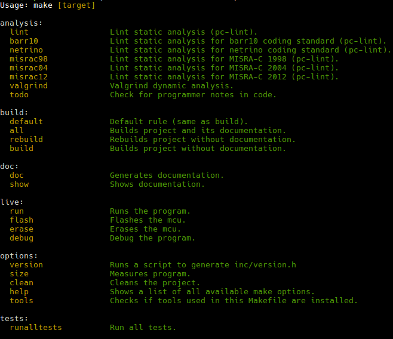

### GNU Makefile project for cross-compile and TDD in C

### Description

> GNU Make makefile for cross-compile and Test driven development in C for
> dual-targeted environments

Uses the **STM32F072RB** micro-controller from ST but it can adapt to any 
embedded platform.

### Goals

All of these are satisfied but need improvement.

1. Test driven development (cppUtest)
2. Multi-architecture Build (GNU/Linux & micro-controller)
3. Lint (pc-lint)
4. Documentation generation (doxygen)
5. Flash, erase etc. micro-controller
6. Debugging (gdb or other)
7. Auto versioning( git or other )
8. Color output
9. Support C/C++ and assembly.

### Dependencies

Required:

Under GNU/Linux environment( Makefile is not tested on Windows or Mac OS )

1. GNU make
2. gcc
3. g++
4. gdb debugger
5. wine
6. pc-lint.exe (with wine)
7. valgrind
8. perl
9. tput
10. git
11. doxygen
12. graphviz
13. cppUtest

```sh
sudo apt-get update
sudo apt-get upgrade
sudo apt-get install make
sudo apt-get install build-essential
sudo apt-get install gdb
#sudo apt-get install wine( build from Github script )
sudo apt-get install valgrind
sudo apt-get install perl
sudo apt-get install libncurses5-dev libncursesw5-dev
sudo apt-get install git
sudo apt-get install doxygen
sudo apt-get install graphviz
#sudo apt-get install cpputest( build from Github )
```

Optional:

1. Segger JLink drivers
2. Saleae logic analyser
3. picocom
4. chromium-browser

```sh
sudo apt-get update
sudo apt-get upgrade
sudo apt-get install picocom
sudo apt-get install chromium-browser
```

### How to use

Create config.mk in the same directory as Makefile and configure your project.
It is included as a dependancy in the Makefile.

To see available targets and help information:

```sh
make help
```


Build with ARM as target:

```sh
make all
```

Build with GNU/Linux as target:

```sh
make PLATFORM=host all
```

Eclipse:

1. Create 'proj/eclipse_workspace' folder if does not exist in project root.
1. Open Eclipse with **proj/eclipse_workspace** as the workspace.
2. Import existing project in the solution.
3. Start developing...

### Maintainer

[Kanelis Ilias](mailto:hkanelhs@yahoo.gr)

### License

[MIT](LICENSE) © Kanelis Ilias